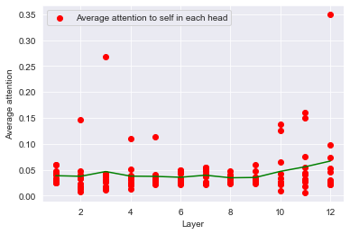

# Attention_analysis
Analysis of Bert's attention heads using huggingface transformers

Unofficial Pytorch implementation of paper [What Does BERT Look At? An Analysis of BERT's Attention](https://arxiv.org/abs/1906.04341) using [HuggingFace Transformers](https://huggingface.co/transformers/).

## Overwiew

BERT-base has 12 layers and each layer has 12 attention heads. Each of the attention heads is of shape `(sequence_length, sequence_length)`. The attentions of whole network can by captured in a four dimensional tensor `attentions_map` of shape `(12,12,sequence_length, sequence_length)`. `attentions_map[i][j][k][l]` tells us the amount of attention k'th word of sequence pays to l'th word in i'th layer and j'th head. This paper sets out to find interesting patterns of attention each of 144 heads exhibit. 

## General Analysis:
### Experimental setup

The paper uses 1000 sequences, each of length 128 to extract attention maps. Due to memory constraints, I used only 150 sequences (each of length 128) but the results were identical to the paper. [WikiText-2](https://www.salesforce.com/products/einstein/ai-research/the-wikitext-dependency-language-modeling-dataset/) dataset was used for analysis carried out in general_analysis.ipynb. Each sequence was of the form `[CLS]<sequence_a>[SEP]<sequence_b>[SEP]`. Attention map is extracted for each sequence and stored in a pickle file. Each attention map is of shape `[NUM_LAYERS, NUM_HEADS, SEQ_LEN, SEQ_LEN]` where `NUM_LAYERS` = 12,  `NUM_HEADS` = 12, `SEQ_LEN` = length of the sequence without the padding tokens.

The authors investigate attentions between several types of tokens:

1. self-self attention:
The amount of attention each word pays to itself on average in every attention head . This corresponds to diagonal elements of the attention maps. Most heads put little attention on the self tokens

